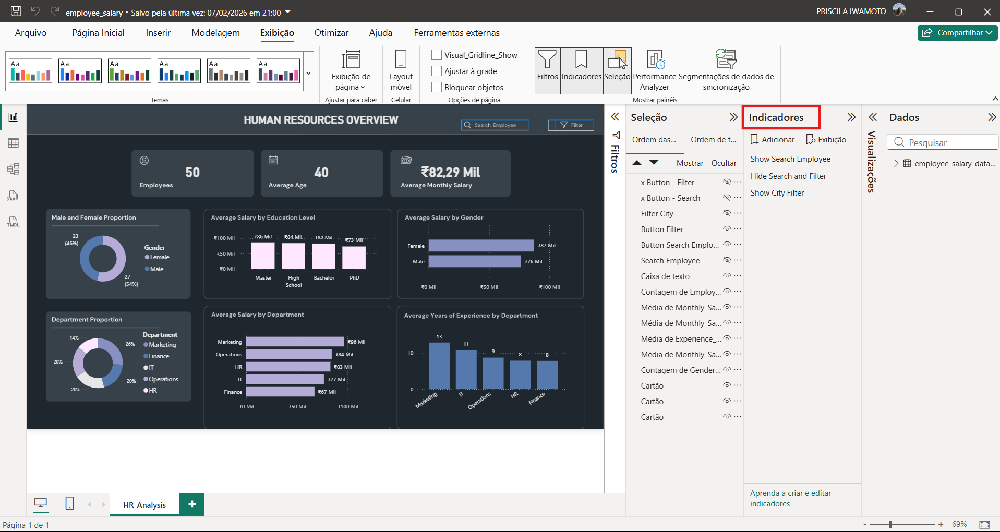

# Human Resources Analysis

## 🎯 Objective

Analyze workforce metrics such as male and female representation, average salary and metrics by department.

## 📊 Key Metrics

* No of employees

* Average age

* Average monthly salary

* Male and female proportion

* Department proportion

* Average salary by education level

* Average salary by gender

* Average salary by department

* Average years of experience by department

* Search by employee or filter by city

## 🔍 About the dashboard

This was a very simple dataset with just one table. I didn't find much trouble with wrong or missing information so I didn't have much work with this matter. I used the bookmark resource to have the possibility to hide the two filters (employee name and city). The main work here was in the design of the dashboard, my goal was to keep it clean and easy to read (that's why I choose to use a dark mode and soft colors) and to make the user experience easier.

Here bellow, the bookmarks used to do the filters:

