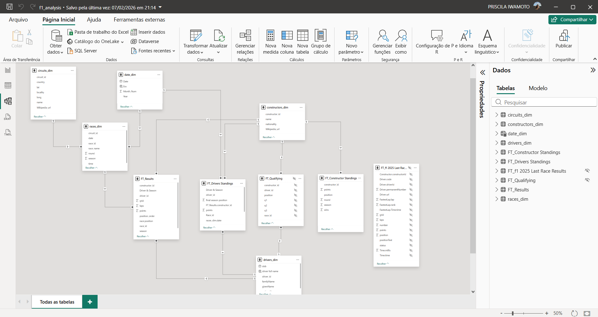
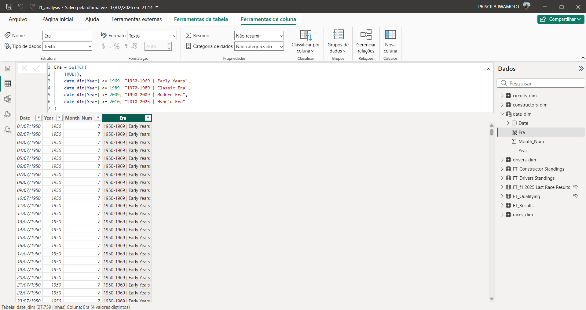

# F1 Analysis

## 🎯 Objective

Analyze the performance of the all time players of F1, such as the constructors and countries envolved.

## 📊 Key Metrics

* No total of races

* No total of circuits

* No total of countries where F1 have been

* Drivers and titles (with drivers detail)

* Winners by nationality

* Drivers wins by constructors

## 🔍 About the dashboard

This dashboard was very fun for me to develop because I don't know nothing at all about F1 and it's metric, so it was a fun way to learn a little bit more about the rules of the game and also the players, maybe I'll even start to follow F1 a little bit more now 😅

About the data modeling: the dataset was made of 9 cvs files at the beginning and I've felt the need to create one more table (date\_dim). It was used  star schema model with 5 facts tables and 5 dimensions.

About DAX and Power Query: I've created two calculated columns, the first one to know in each era the pilot drove and the other one to have de pilot's full name. For this information I needed the analysis roll by roll and thats why I choose the calculated column. I've also created DAX metrics to calculate driver's 1st positions and drivers points variation. I used the the tool tip resource in this dashboard to show detailed information about the drivers, this way I could give the information I wanted without visually pollute the dashboard.

Besides that, I've created another few columns to use as key in the relationships and I noticed that the database wasn't entirely correct, with missing information about a few races or eras. So I consulted the F1 oficial website to make sure I was delivering the right information but this limited the data I could show. 

Bellow is the starschema model. Two of the tables wasn't necessary to the dashboard, since they weren't affecting the dashboard's performance, I simply hid them and didn't delete them in case this information were useful in the future.

One of the calculated columns to figure out wich era corresponded to wich year:

